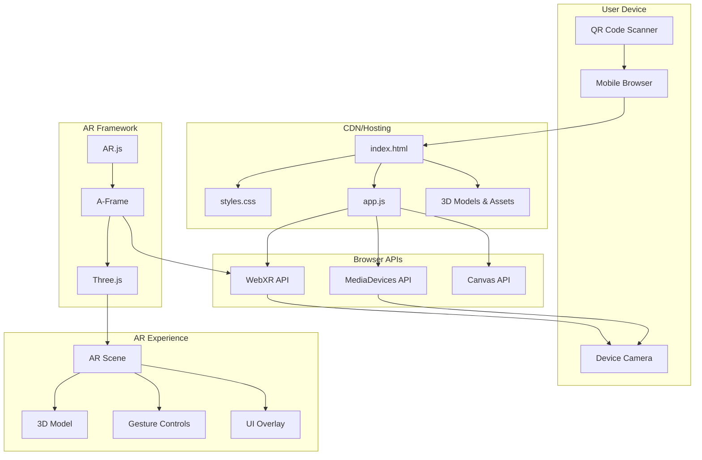
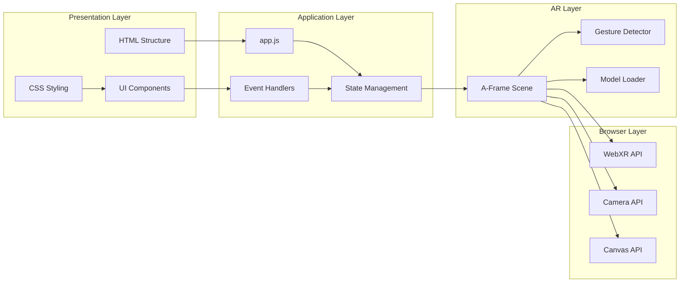
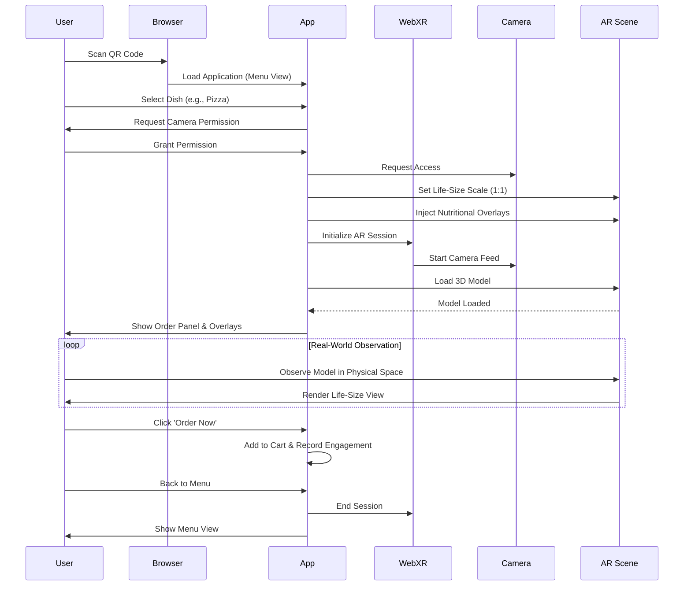
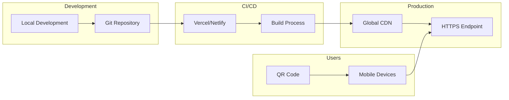

# 🏗️ WebAR Architecture Documentation

Technical architecture and design decisions for the WebAR Experience.

---

## System Architecture



---

## Component Architecture



---

## Data Flow



---

## File Structure

```
WebAR/
│
├── index.html              # Main entry point
│   ├── A-Frame scene setup
│   ├── UI overlays (loading, permission, error)
│   ├── AR controls
│   └── Gesture handler component
│
├── styles.css              # Styling
│   ├── CSS variables (theming)
│   ├── Overlay screens
│   ├── Glassmorphic UI
│   ├── Animations
│   └── Responsive design
│
├── app.js                  # Core logic
│   ├── State management
│   ├── Device capability detection
│   ├── WebXR session handling
│   ├── Model loading
│   ├── Event handlers
│   ├── Error handling
│   └── Performance monitoring
│
├── models/                 # 3D assets
│   └── *.glb / *.gltf
│
├── assets/                 # Additional resources
│   ├── icons/
│   └── images/
│
├── vercel.json            # Vercel config
├── netlify.toml           # Netlify config
├── package.json           # Dependencies
├── .gitignore             # Git ignore
│
└── Documentation/
    ├── README.md
    ├── DEPLOYMENT_GUIDE.md
    ├── QR_CODE_GUIDE.md
    ├── TESTING_CHECKLIST.md
    └── ARCHITECTURE.md (this file)
```

---

## Technology Stack

### Frontend Framework
- **HTML5**: Semantic structure
- **CSS3**: Modern styling with custom properties
- **JavaScript (ES6+)**: Application logic

### AR Framework
- **A-Frame 1.5.0**: WebXR framework
  - Declarative AR scene setup
  - Entity-component system
  - Built on Three.js
  
- **AR.js**: Additional AR capabilities
  - Marker-based AR fallback
  - Enhanced tracking

- **Gesture Detector**: Touch interaction
  - Single finger drag (move)
  - Two finger rotation
  - Pinch to scale

### Browser APIs
- **WebXR Device API**: AR session management
- **MediaDevices API**: Camera access
- **Canvas API**: Rendering
- **Performance API**: Monitoring

### Hosting & Deployment
- **Vercel** (recommended): Serverless, global CDN
- **Netlify**: Alternative hosting
- **GitHub Pages**: Free hosting option

---

## Design Patterns

### State Management

```javascript
const AppState = {
    isARSupported: false,
    isARActive: false,
    modelLoaded: false,
    currentModel: null,
    performanceMode: 'high',
    debugMode: false,
};
```

**Pattern**: Centralized state object
**Benefits**: 
- Single source of truth
- Easy debugging
- Predictable state changes

### Event-Driven Architecture

```javascript
// Event listeners
elements.arScene.addEventListener('loaded', onSceneLoaded);
elements.arModel.addEventListener('model-loaded', onModelLoaded);
```

**Pattern**: Observer pattern
**Benefits**:
- Loose coupling
- Extensible
- Easy to test

### Error Handling

```javascript
try {
    // Operation
} catch (error) {
    console.error('Error:', error);
    showError(title, message);
}
```

**Pattern**: Try-catch with user feedback
**Benefits**:
- Graceful degradation
- User-friendly errors
- Debugging information

---

## Performance Optimizations

### 1. Lazy Loading

```javascript
// Load model only after scene is ready
function loadModel() {
    elements.arModel.setAttribute('gltf-model', modelURL);
}
```

### 2. Device Tier Detection

```javascript
function detectPerformanceTier() {
    const memory = navigator.deviceMemory || 4;
    const cores = navigator.hardwareConcurrency || 4;
    
    if (memory >= 6 && cores >= 6) {
        AppState.performanceMode = 'high';
    } else if (memory >= 4 && cores >= 4) {
        AppState.performanceMode = 'medium';
    } else {
        AppState.performanceMode = 'low';
    }
}
```

### 3. Asset Optimization

- **GLB Compression**: Draco compression
- **Texture Optimization**: Power-of-2 dimensions
- **Polygon Reduction**: < 50k triangles
- **File Size**: < 5MB

### 4. Rendering Optimization

```javascript
renderer="logarithmicDepthBuffer: true; 
         colorManagement: true; 
         sortObjects: true;"
```

---

## Security Considerations

### HTTPS Enforcement

```json
// vercel.json
{
  "headers": [{
    "source": "/(.*)",
    "headers": [
      {
        "key": "Permissions-Policy",
        "value": "camera=*, microphone=(), geolocation=()"
      }
    ]
  }]
}
```

### Camera Permissions

- Only requested when user initiates AR
- Clear explanation before request
- Graceful handling of denial
- No persistent storage of camera data

### Content Security

- No external script injection
- Trusted CDN sources only
- No user-generated content execution

---

## Browser Compatibility

### Supported Browsers

| Browser | Version | AR Support | Notes |
|---------|---------|------------|-------|
| **iOS Safari** | 15.4+ | ✅ WebXR | Limited compared to Android |
| **Android Chrome** | 79+ | ✅ WebXR | Full support |
| **Samsung Internet** | 11.2+ | ✅ WebXR | Good support |
| **Firefox Mobile** | Any | ❌ | Fallback 3D viewer |
| **Chrome iOS** | Any | ❌ | Fallback 3D viewer |

### Feature Detection

```javascript
async function checkDeviceCapabilities() {
    if (!navigator.xr) {
        showUnsupportedScreen();
        return;
    }
    
    const isARSupported = await navigator.xr
        .isSessionSupported('immersive-ar');
    
    if (isARSupported) {
        AppState.isARSupported = true;
        loadModel();
    } else {
        showUnsupportedScreen();
    }
}
```

---

## Scalability Considerations

### Current Architecture
- **Static site**: No backend required
- **CDN delivery**: Global distribution
- **Client-side rendering**: No server load

### Future Enhancements

1. **Backend Integration**
   - User accounts
   - Model library
   - Analytics storage

2. **Multi-Model Support**
   - Dynamic model selection
   - CMS integration
   - User uploads

3. **Multiplayer AR**
   - WebRTC for communication
   - Shared AR spaces
   - Real-time synchronization

4. **Advanced Features**
   - WebXR anchors (persistent placement)
   - Occlusion (real-world depth)
   - Lighting estimation
   - Hand tracking

---

## Monitoring & Analytics

### Performance Metrics

```javascript
// FPS monitoring
function updateStats() {
    const fps = calculateFPS();
    const memory = performance.memory.usedJSHeapSize;
    
    // Log or send to analytics
}
```

### Error Tracking

```javascript
window.addEventListener('error', (event) => {
    console.error('Global error:', event.error);
    // Send to error tracking service
});
```

### User Analytics (Optional)

- Page views
- AR session starts
- Interaction events
- Error rates
- Device types
- Browser versions

---

## Deployment Architecture



---

## API Reference

### AppState Object

```javascript
AppState = {
    isARSupported: boolean,    // WebXR availability
    isARActive: boolean,        // AR session active
    modelLoaded: boolean,       // 3D model loaded
    currentModel: Object,       // Model reference
    performanceMode: string,    // 'high'|'medium'|'low'
    debugMode: boolean,         // Debug features enabled
}
```

### Configuration Object

```javascript
CONFIG = {
    defaultModel: string,       // Model URL
    models: Object,             // Model library
    modelDefaults: {
        position: {x, y, z},
        rotation: {x, y, z},
        scale: {x, y, z}
    },
    performance: {
        targetFPS: number,
        minFPS: number,
        memoryWarningMB: number
    }
}
```

### Public Methods

```javascript
// Reset model to default state
WebARApp.resetModel()

// Capture screenshot
WebARApp.captureScreenshot()

// Log current state
WebARApp.logState()
```

---

## Troubleshooting Guide

### Common Issues

| Issue | Cause | Solution |
|-------|-------|----------|
| Camera not working | HTTPS not enabled | Deploy with HTTPS |
| Model not loading | CORS issue | Host model on same domain |
| AR not starting | Browser unsupported | Check compatibility |
| Low FPS | Model too complex | Optimize model |
| Gestures not working | Event conflicts | Check console for errors |

---

## Version History

- **v1.0.0** (Current)
  - Initial release
  - WebXR support
  - A-Frame integration
  - Touch gestures
  - Error handling
  - Performance optimization

---

## Future Roadmap

### Phase 2
- [ ] Multiple model selection
- [ ] Screenshot sharing
- [ ] Custom branding

### Phase 3
- [ ] WebXR anchors
- [ ] Lighting estimation
- [ ] Occlusion

### Phase 4
- [ ] Multiplayer AR
- [ ] Backend integration
- [ ] User accounts

---

**📚 For more information, see:**
- [README.md](README.md) - Getting started
- [DEPLOYMENT_GUIDE.md](DEPLOYMENT_GUIDE.md) - Deployment instructions
- [TESTING_CHECKLIST.md](TESTING_CHECKLIST.md) - Testing procedures

---

*Last updated: 2026-02-02*
